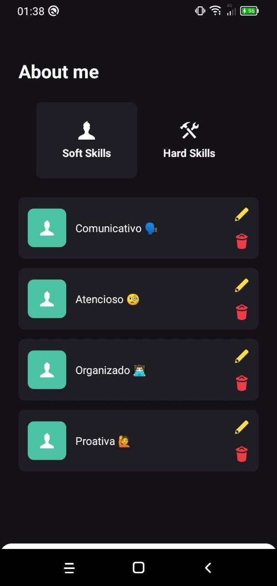
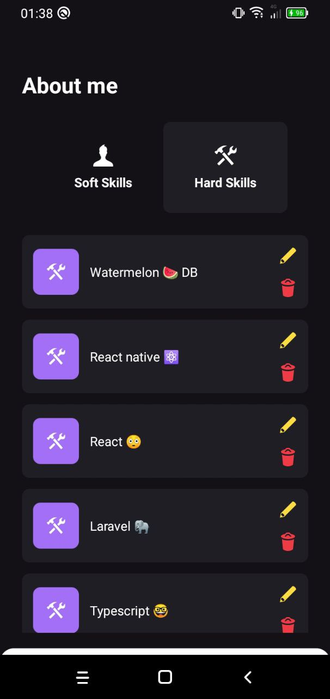

<h1 align="center">
  My Skills 🧙‍♂️ usando WatermelonDB 🍉
</h1>
<p align="center">
 
  
  
</p>

## 💻 Projeto

A aplicação criada no Decode#26 foi criada com a finalidade de ensinar/aprender um pouco mais sobre o ORM WatermelonDB 🍉 que é uma grande opção para
quem procura otimização de dados, persistência offline e tratamento com excelência às migrações do banco de dados.

## 🔨 Aprendizado

- [x] Tipagens de componentes usando Styled Components
- [x] Utilização da lib react-native-bottom-sheet para componente de criação de skills ou edição delas
- [x] Operações de crud com WatermelonDB 🍉 da forma certa

## ✍ Tecnologias

- [x] React Native
- [x] Typescript
- [x] Expo
- [x] WatermelonDB
- [x] Styled Components

## 🏃‍♂️ Executando o projeto

Clone o repositório.

Use o **yarn** ou **npm install** para instalar as dependências.
Com o projeto aberto execute os comandos abaixo para rodar a aplicação.

```bash
# Em um terminal isolado
npx react-native start

# Em outro terminal
npx react-native run-android
```
